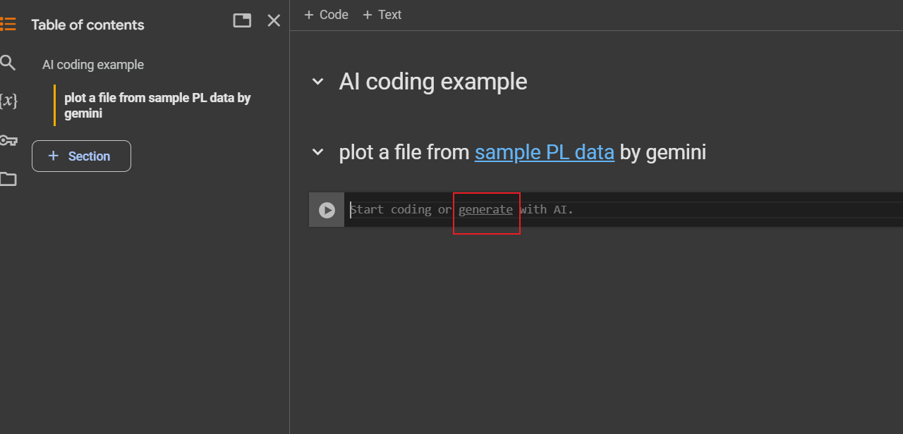
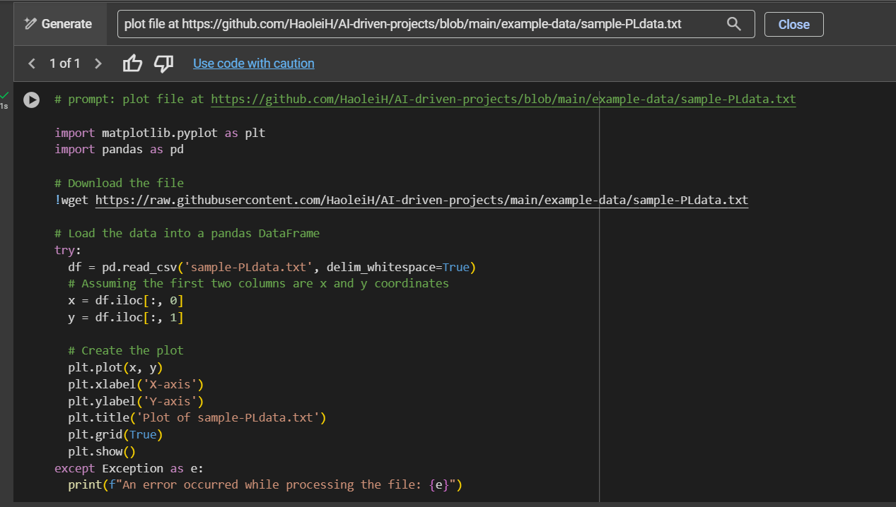
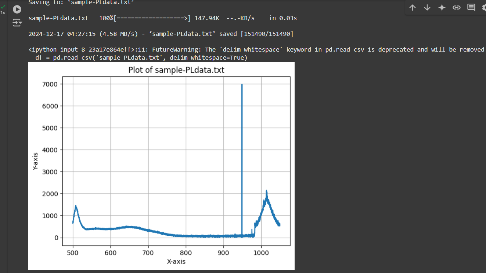
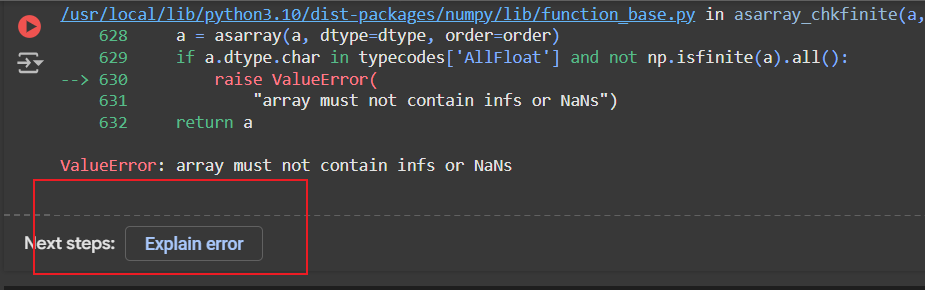
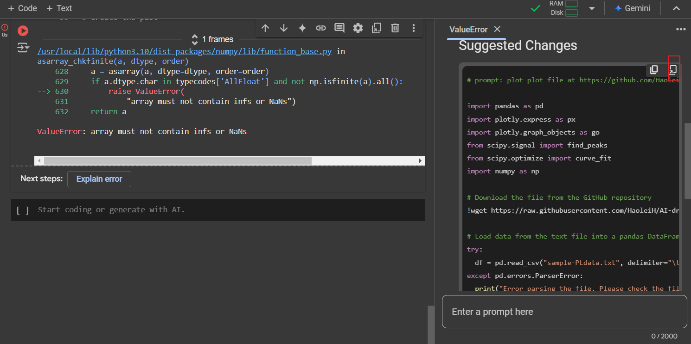

# AI coding exmaple on colab

By using prompt like
> plot file at https://github.com/HaoleiH/AI-driven-projects/blob/main/example-data/sample-PLdata.txt, use first row as column name, set x range to be 500 to 600, y range to be 0 to 1500, use plotly to plot

we can get result without writing any code. click  to run example code in colab. google colab provides a free python environment that can be used even without logging in. just give it a try.

detailed procedures shown below:

1. find place

2. enter prompt

3. run  code
 
4. handle errors(if any)

5. run modified code
