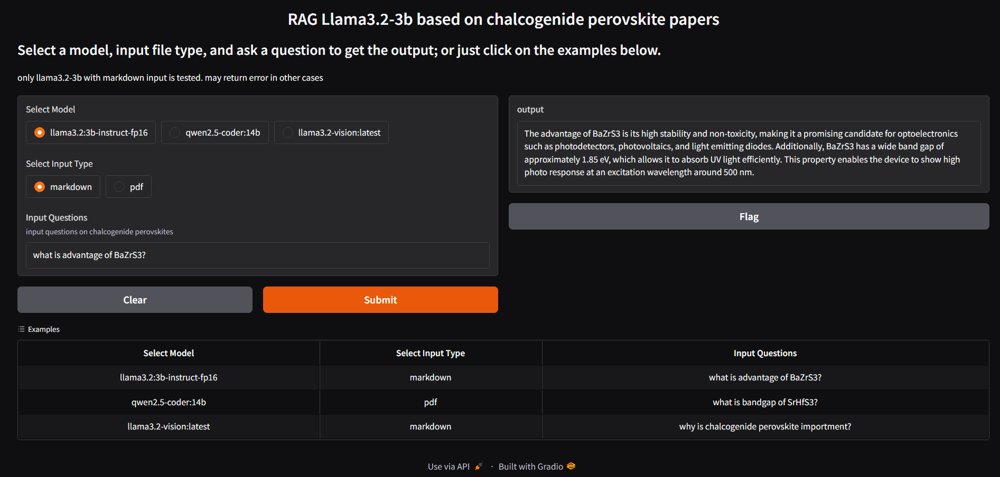

# RAG using Llama3.2-3b

[Open in Kaggle](https://www.kaggle.com/code/haoleihui/cp-rag-llms)
# How it works

This graph show the major procedures in a RAG system. Most time consuming process is 3 -> 4 ->5. when you ask a question, the system need to search in a vector database to find related context, then pass the context together with the question to a large language model, combining with a prompt to tell it answering questions based on the context.
# Results
This folder contains the notebook I used in local computer for testing. The kaggle notebook is running on its free Nvidia P100 GPU.

Results of using pdf and markdown as input and shown below.

Markdown input

pdf input

# Future plans
1. higher performance retrieving by using other vector data base like FAISS, Weaviate, Qdrant AND Chroma
2. Continuing from RAG with markdown input, we need to find a way to retrieve graph in input files.

# updated 12192024

Uploaded [rag-with-llama-and-faiss.ipynb](./rag-with-llama-and-faiss.ipynb). 

Following changes are mode:

1. moved to FAISS vector database. FAISS naturally supports both image and text input.
2. removed pdf imput
3. fixed the code that builds the vector database every time when perfroming a search. Now it takes 3-8s to give a response.
4. added choices for using RAG or not, so user can compare. Picture of the interface will be added soon.

