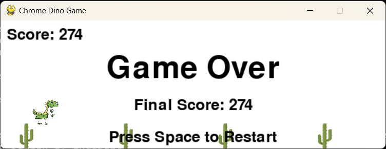
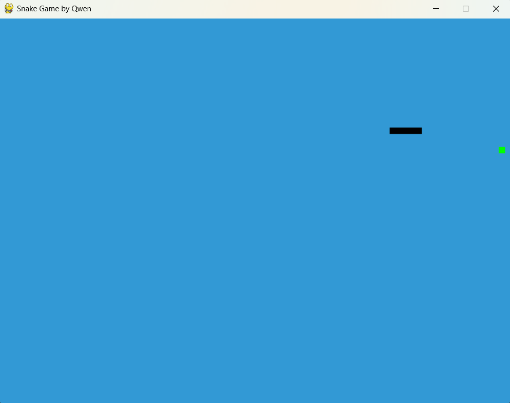

# AI-driven-projects
this repo contains some codes writen with the help of large language models like ChatGPT and Qwen.

## ocr translate 
see [this](https://github.com/HaoleiH/ocr_test). this is the first project I started with AI assisted programing.

## read plot
see [this](https://github.com/HaoleiH/read_plot). this is the second project. it is also hosted at [github pages](https://haoleih.github.io/HaoleiHui/readplot/read_plot.html) so that people can directly open this website and use it.

## dino game
this folder contains the programs to implement a chrome offline dino game. the most successful version is dino_qwen2.py. I also tried to make a script to automatically detect obstacles and jump to reach high score, but didn't finish it.

A screenshot of the dino game is shown here. 

## snake game
this folder contains code to build a snake game. a screen shot is shown here 

## markdown rendering
this html file convert markdown to html or pdf. render_markdown_final.html is the final usable file. known issue is that it won't render equations like this $e^{i\pi}+1 = 0$.

## data extraction

using google's Gemini to extract data from scientific papers. also tried llama 3.2 vision, ChatGPT, google deplot. not as good as gemini. click button above to run in colab.

This is one of the foundational components of a scientific Retrieval-Augmented Generation (RAG) large language model(LLM). The ultimate goal is to create a system similar to Google’s [NotebookLM](https://notebooklm.google.com/), enhanced with graph processing capabilities. This system would allow you to ask questions and receive answers from large language models based on the papers you provide.

## MinerU to convert pdf to markdown

[Open in Kaggle](https://www.kaggle.com/code/haoleihui/mineru-test)

Hosting a notebook in kaggle to convert scientific papers from human-readable pdf files to machine readable markdown files by using [MinerU](https://github.com/opendatalab/MinerU). Kaggle provide resources like free CPU and 30 hours GPU per week so it is good for testing and sharing. One example of vonersion is shown in [kaggle-MinerU](./kaggle-MinerU/test1.md). Now the notebook is purely running on CPU fore testing and is a little slow. A GPU acceleration will be added in the furture. Or you can check MinerU's office [documentation](https://github.com/opendatalab/MinerU?tab=readme-ov-file#using-gpu) if you want to develop your own code to enable GPU acceleration.

This is also one of the foundational components of a scientific Retrieval-Augmented Generation (RAG) large language model(LLM). The ultimate goal is to create a system similar to Google’s [NotebookLM](https://notebooklm.google.com/), enhanced with graph processing capabilities. This system would allow you to ask questions and receive answers from large language models based on the papers you provide.

