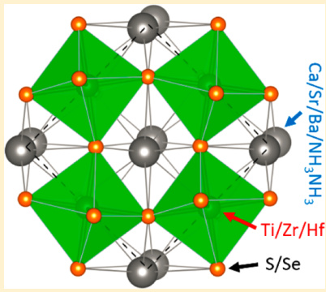
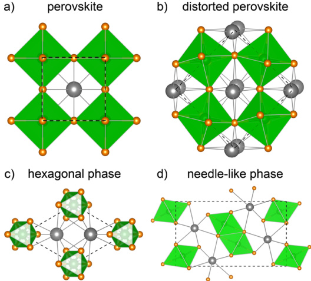
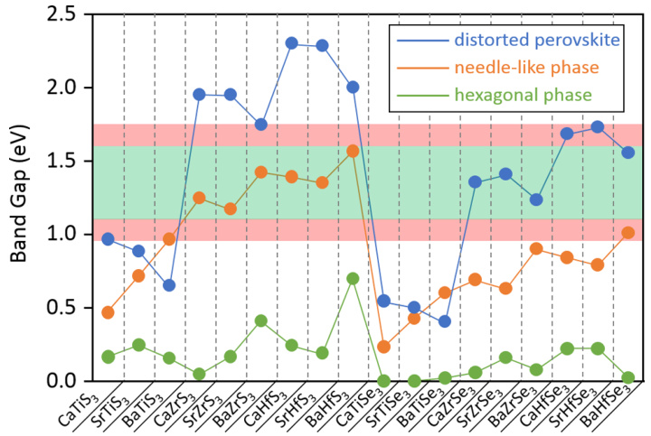
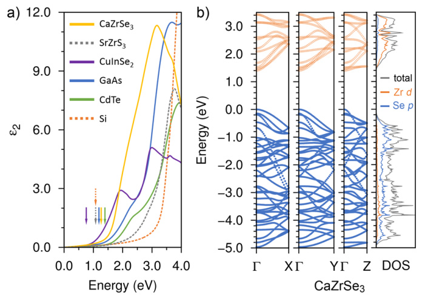
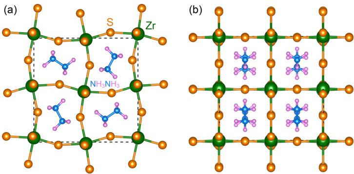

# Chalcogenide Perovskites for Photovoltaics  

Yi-Yang Sun,\*t Michael L. Agiorgousis, Peihong Zhang,\$ and Shengbai Zhang\*,\*  

Department of Physics, Applied Physics & Astronomy, Renselaer Polytechnic Institute, Troy, New York 12180, United States sDepartment of Physics, University at Buffalo SUNY, Bufflo, New York 14260, United States   
International Center for Quantum and Molecular Structures and Department of Physics, Shanghai University, Shanghai 200444, China  

# $\circledcirc$ Supporting Information  

ABSTRACT: Chalcogenide perovskites are proposed for photovoltaic applications. The predicted band gaps of $\mathrm{CaTiS}_{3},\,\mathrm{BaZrS}_{3},\,\mathrm{CaZrSe}_{3},$ and $\mathrm{CaHfSe}_{3}$ with the distorted perovskite structure are within the optimal range for making single-junction solar cells. The predicted optical absorption properties of these materials are superior compared with other highefficiency  solar-cell  materials.  Possible replacement of the alkaline-earth  cations by molecular cations, e.g. $(\mathrm{NH}_{3}\mathrm{NH}_{3})^{2+}.$ as in the organic-inorganic halide perovskites (e.g, $\mathrm{CH}_{3}\mathrm{NH}_{3}\mathrm{PbI}_{3})$ , are also proposed and found to be stable. The chalcogenide perovskites provide promising candidates for addressing the challenging issues regarding halide perovskites such as instability in the presence of moisture and containing the toxic element Pb.  

KEYWORDS: Perovskites, chalcogenides, photovoltaics, zirconium, titanium, optical absorption  

  

norganic-organic  halide perovskites  represent a  major I breakthrough in the development of photovoltaic materials. Since 2009, the power conversion efficiency (PCE) of solar cells made of this type of materials has witnessed an unprecedented rate of increase.2-9 The highest certified PCE of $\dot{1}7.9\%^{10}$ is already on par with the most mature thin-film solar-cell materials such as CdTe and $\mathrm{Cu}(\mathrm{In},\!\mathrm{Ga})\mathrm{Se}_{2}$ 11 In addition to the high PCE achieved with the halide perovskites, these materials are composed of only earth-abundant elements and can be prepared by various low-cost methods.712,13 It is therefore highly anticipated that solar cells based on the perovskite materials could be deployed on the industrial scale. The research on these materials now focuses on several remaining challenging issues, for instance, the high PCE solar cells are still based on $\mathrm{Pb}_{.}$ . which is of great environmental concern, and the halide salts tend to dissociate in the presence of moisture, which causes stability issue for long-term 10,14 usage.  

Oxide perovskites are more resistant to water and have recently been reported to be promising solar absorbers by engineering the band gap to match the solar spectrum.15 So far, the chalcogenide perovskites based on S and Se have not attracted attention from the photovoltaic community even though such materials have been experimentally synthesized since the 1950s.1° Most of the previous studies have focused on structural characterization. Lee et al.17 and Bennett et al.18 reported  the  density of states  of $\mathrm{Sr}Z\mathrm{r}S_{3}$ and $\mathtt{B a Z r S}_{3},$ respectively, which were obtained using tight-binding and density functional theory (DFT) calculations based on the local density approximation. There has been no accurate knowledge of the band gaps and, in particular, optical properties, available for the chalcogenide perovskite materials, based on which their potential  for photovoltaic applications may be evaluated. Considering the advantage that these chalcogenide perovskites are based on the Group-IIA (Ca, Sr, and Ba) and Group-IVB $\mathrm{(Ti,~Zr,~}$ and Hf) elements, which are more environmentfriendly as opposed to the $\mathbf{Pb}$ -based halide perovskites, it is of great interest to study these materials for photovoltaic applications.  

In this paper, based on first-principles calculations we propose that chalcogenide perovskites $\mathrm{ABX}_{3},$ where A and B represent $^{2+}$ and $^{4+}$ cations, respectively, and $\mathrm{X}$ represents either S or Se, could be promising materials for thin-flm solarcell applications. For example, $\mathrm{CaZrSe}_{3}$ is predicted to have a direct band gap of $1.35\ \mathrm{\eV}_{\mathrm{~\,~}}$ ，which is ideal for solar-cell materials.19 It also has superior optical absorption properties when compared with other mature solar-cell materials. Replacing A cations by molecular cations as in the halide perovskites preserves these desirable properties. Among the other known phases of $\mathrm{ABX}_{3}$ chalcogenides, we found that the hexagonal phase had too small band gaps to be useful for solar cells, while the needle-like phase had pseudodirect band gaps, which are not suited for making thin-film solar cells.  

A number of sulfide perovskites have been synthesized experimentally, $^{16,17,20-24}$ Three phases at ambient conditions have been known for these materials, as shown in Figure 1 together with the ideal perovskite structure without distortion (Figure la). Most of these materials are crystallized in the  

  
Figure 1. Different phases for the $\mathrm{ABX}_{3}$ compounds.(a)Ideal perovskite phase without distortion. (b) Distorted perovskite phase with the Pnma space group (No. 62). (c) Hexagonal phase with the $P6_{3}/m m c$ space group (No. 194). (d) Needle-like phase also with the Pnma space group. Gray and brown spheres represent A cations and X anions, respectively. The B cations are located at the centers of the green-colored octahedrons.  

orthorhombic distorted perovskite  (or $\mathrm{GdFeO}_{3},$ ） structure (Figure 1b) with the space group Pnma (No. 62).2? In some $(\mathbf{e.g.},\ \,\mathbf{BaTiS}_{3})$ $\mathrm{BaNiO}_{3}$ $P6_{3}/m m c$   
was reported.1620 In this hexagonal phase, the coordinations of the cations are similar to that of the perovskite structure, namely, the A cation is 12-coordinate and the B cation is 6- coordinate. Another needle-like phase with the $\mathrm{NH}_{4}\mathrm{CdCl}_{3}$ structure has been reported for $\mathrm{SrZrS}_{3},^{17}\ \mathrm{SrZrSe}_{3},$ and its alloy with BaZrSe3.2° F 2° Even though this needle-like phase also has the symmetry of the space group Pnma, its structure (Figure 1d) is significantly different from that of the perovskite structure. While the $B$ cation remains to be 6-coordinate, the coordination number for the $A$ cation in the needle-like phase is reduced to 9, suggesting that it loses the key characteristics of the perovskite structure.  

Here we study the $\mathrm{ABX}_{3}$ compounds with $\mathrm{A}=\mathrm{Ca},\;\mathrm{Sr}$ and Ba, $\mathrm{B}=\mathrm{Ti},\mathrm{Zr},$ and Hf, and ${\boldsymbol{\mathrm{X}}}={\boldsymbol{\mathrm{S}}}$ and Se. For each compound, we consider all the three phases as described above. Our firstprinciples calculations were based on DFT as implemented in the VASP program.27 The atomic structures were optimized using the PBEsol functional.28 The band gap and the imaginary part of the dielectric constant29 were calculated using the hybrid HSE06 functional30 where the mixing parameter $\alpha$ controlling the amount of the Hartree-Fock (HF) exchange energy was set to 0.25 and the screening parameter $\omega$ separating out the long-range part of the HF exchange was set to $0.2\,\mathrm{\AA^{-1}}$ . The ion-cores are described within the projector augmented wave method.31 A cutoff energy of 30 and $20~\mathrm{Ry}$ was used for the plane-wave basis set in structural optimization and the calculation of optical properties, respectively. A $9\times7\times$ 9 $.7\times15\times5,$ and $9\,\times\,9\,\times\,11$ k-point grid was used in the PBEsol calculations for the distorted perovskite, needle-like, and hexagonal phases, respectively. A $7\times5\times7$ and $5\times11\times3$ grid was used in  the HSE06 calculations of the optical properties for the distorted perovskite and needle-like phases, respectively. In structural optimization, the force criterion was set to 0.5 mRy/Bohr.  

We first calculate the band gap of these materials, which is the key quantity for selecting solar-cell materials. Figure 2 shows the calculated band gaps for all $18\;\mathrm{ABX}_{3}$ compounds in the three phases. It can be seen that for the same compound the distorted perovskite phase in general has the largest band gap and the hexagonal phase has the smallest (for several cases no) band gap. The valence band maximum (VBM) states of these materials are composed of predominantly chalcogen p orbitals, while the conduction band minimum (CBM) states are composed of predominantly transition metal d orbitals. This explains another two trends observed for the calculated band gaps: (1) the sulfdes show larger band gaps than the corresponding selenides by about $0.5{-}0.6\ \mathrm{eV}$ for the distorted perovskite and needle-like phases, because the 3p orbitals of S are lower than the $4\mathrm{p}$ orbitals of Se.(2）The Ti-based compounds show the smallest band gaps compared with corresponding $^{2\mathrm{r}-}$ and Hf-based compounds because the Ti 3d orbitals are significantly lower than Zr 4d and Hf 5d orbitals. Hf-based materials show larger band gaps than the corresponding $Z\mathbf{r}$ -based materials because the 5d orbitals of Hf are even higher than the 4d orbitals of $_\mathrm{Zr}$  

  
Figure 2.Bandgapof $18\ \mathrm{~ABX}_{3}$ compounds in  the distorted perovskite, needle-like, and hexagonal phases calculated with the HSE06 functional. The optimal band gap region for solar-cell materials is highlighted in light green. An extended region with theoretical efficiency above $28\%$ is highlighted in light red.  

The combination of the different variables discussed above (i.e., the structure and the positions of transition metal d orbitals and chalcogen p orbitals） allows great flexibility in selecting suitable solar-cell materials. A number of materials show band gaps located within the optimal range as highlighted in light green in Figure 2, within which the high-efficiency solarcell materials, such as Si, GaAs, CdTe, $\bar{\mathrm{Cu}}(\mathrm{In},\mathrm{Ga})\mathrm{Se}_{2},$ and $\mathrm{CH}_{3}\mathrm{NH}_{3}\mathrm{PbI}_{3},$ are located. In the needle-like phase, all of the $^{7\!}x\cdot$ and Hf- based sulfides possess band gaps in the optimal range. In the distorted perovskite phase, the three $Z\mathbf{r}$ -based selenides  and $\mathrm{BaHfSe}_{3}$ are in the optimal range. In the hexagonal phase, all materials have small band gaps that are not suited for making solar cells. In Figure 2, an extended range by expanding $0.15~\mathrm{eV}$ on both sides of the optimal range, which corresponds to a theoretical efficiency of above $28\%$ according to the Shockley-Queisser theory, 1? is highlighted in light red. Within this extended range, $\mathrm{CaTiS}_{3},$ $\mathrm{BaZrS}_{3},$ ${\mathrm{CaHfSe}}_{3},$ and $\mathrm{SrHfSe}_{3}$ in the distorted perovskite phase and ${\bf B}\mathrm{aTiS}_{3}$ and $\mathrm{BaHfSe}_{3}$ in the needle-like phase are included. All of these materials show a direct band gap at the Brillouin zone center ( $\mathrm{T}$ point), which is desirable for making thin-film solar cells.  

To evaluate the accuracy in the calculated band gap, we conducted a well-converged quasi-particle GW calculation for $\mathrm{CaZrSe}_{3}$ in the distorted perovskite structure (see Figure S1 in Supporting Information), which gives a slightly larger band gap by $0.17~\mathrm{eV}$ than the HSE06 method. For $_\mathrm{Zr}$ -based compounds in the distorted perovskite structure, we also evaluated the effect of spin-orbit coupling, which pushes the valence band maximum to higher energy and reduces the band gap. It was found that for the selenides the band gap reduction due to the spin-orbit coupling is about $0.15\;\mathrm{eV}_{\cdot}$ which roughly cancels the possible error in HSE06 when compared with the GW result, while for the sulfides the band gap reduction due to the spinorbit coupling effect is smaller $(\sim\!0.07\,\mathrm{\eV})$ . Based on these results, we estimate that the band gaps reported in Figure 2 are accurate to within about $0.1\ \mathrm{eV}.$  

In addition to the band gap, another important property for solar-cell materials is the optical absorption. Figure 3a shows the calculated imaginary part of the dielectric function $\left(\protect\varepsilon_{2}\right)$ which determines the optical absorption properties of semiconductor materials. Results for several high-efficiency solar-cell materials, namely, Si, GaAs, CdTe, and $\mathrm{CuInSe}_{2},$ are also included in Figure 3a for comparison. Below about $1.9\,\mathrm{\eV},$ ${\mathrm{CuInSe}}_{2}$ has the largest $\varepsilon_{2}$ which is partly because ${\mathrm{CuInSe}}_{2}$ has a smaller band gap than the other materials and therefore has an earlier onset for optical absorption. $\mathrm{From\1.9}$ to $3.4\ \mathrm{eV},$ $\mathrm{CaZrSe}_{3}$ in the distorted perovskite structure has the largest $\varepsilon_{2}.$ Since about $98\%$ of the solar power reaching the earth's surface is contributed by photons below $3.4~\mathrm{eV}$ according to the AM1.5 solar spectrum, $\mathrm{CaZrSe}_{3}$ in the distorted perovskite structure is identified to be a promising solar-cell material. On the contrary, even though the $^{\mathrm{~Zr.~}}$ and Hf-based sulfides in the needle-like phase also have suitable band gaps, the onsets of their optical absorption are significantly higher than their fundamental band gaps, as marked by arrows in Figure 3a. The case of $\mathrm{Sr}Z\mathrm{r}S_{3}$ as an example is shown in Figure 3a. Its absorption behavior is analogous to indirect band gap materials, such as Si (also shown in Figure 3a). Thus, our results suggest that the needle-like phase has a pseudodirect band gap, which is not suited for making thin-film solar cells.  

  
Figure 3. (a) Imaginary part of the dielectric constant $\left(\protect\varepsilon_{2}\right)$ calculated for $\mathrm{CaZrSe}_{3}$ in the distorted perovskite phase and $S\mathrm{r}Z\mathrm{r}S_{3}$ in the needle-like phase using the HSE06 functional, which are compared with $\mathrm{CuInSe}_{2},$ GaAs, CdTe, and Si. The arrows mark the position of the fundamental band gap. For noncubic structures, the average of the three principal directions is plotted. (b) Band structure along the $\Gamma\mathrm{-}\mathrm{X},$ $\Gamma{\mathrm{-}}\mathrm{Y},$ and $\Gamma{-}Z$ directions and density of states (DOS) of $\mathrm{CaZrSe}_{3}$ in the distorted perovskite phase. The site-projected DOS on the Zr 4d andSe $4\mathrm{p}$ orbitals are shown together with the total DOS.  

Figure 3b shows the band structure of $\mathrm{CaZrSe}_{3}$ along the three principal directions and the density of states (DOS). From the projected DOS onto the $\mathrm{}Z\mathbf{r}~4\mathrm{d}$ and Se 3p orbitals, it can be seen that the upper valence bands are predominantly contributed by Se 4p orbitals, while the lower conduction bands are predominantly  contributed by $Z\mathbf{r}$ 4d orbitals. For comparison, the band structure and DOS for representative compounds, i.e., $\mathrm{BaHfS}_{3}$ in the hexagonal phase and $\mathrm{Sr}Z\mathrm{r}S_{3}$ in the needle-like phase, are presented in Figure S2 in Supporting Information. The distorted perovskite phase has a 3-dimensional network of corner-sharing B-site-centered octahedra, while the hexagonal and needle-like phases have one-dimensional  chains  of face-sharing and  edge-sharing  octahedra, respectively. This structural difference is reflected in the band structures of $\mathrm{BaHfS}_{3}$ and $\mathrm{Sr}Z\mathrm{r}S_{3}$ (see Figure S2), where the lowest conduction bands show a more prominent dispersion along the direction of the octahedral chains than along the other two perpendicular directions, resulting in a larger anisotropy of the electron mobility in the hexagonal and needle-like phases than in the distorted perovskite phase.  

Typically, when the band edges are composed of d orbitals, the absorption coefficient is large because the localized d orbitals have a high DOS arising from their high degree of degeneracy. For example, both the upper valence bands and lower conduction bands of $\mathrm{FeS}_{2}$ have significant contributions from Fe 3d electrons. As a result, $\mathrm{FeS}_{2}$ is among the semiconductor materials having the largest absorption coefficients.32 On the other hand, having a significant d character could also result in large effective masses, leading to low intrinsic carrier mobility. For $Z\mathbf{r}$ -based perovskite solar materials, however, this issue could be mitigated by two factors. First, the 4d electrons are much less localized than 3d electrons. The band structure in Figure 3b shows large dispersions near band edges, suggesting good carrier transport properties. The calculated electron (hole) effective masses are 0.28 (0.59), 0.41 (0.46), and 0.57 (0.15) $m_{0}$ (electron rest mass), respectively, along the $\Gamma{-}\mathrm{X},\,\Gamma{-}\mathrm{Y},$ and $\Gamma{-}Z$ directions. Second, because of the large absorption coefficient, the absorber layer can be made so thin (with a thickness much smaller  than $1\ \mu\mathrm{m})$ that the carrier mobility is not the dominating factor for the efficiency. For example, at incident photon energy of $2.5\ \mathrm{eV},$ where the solar spectral irradiance reaches the maximum, the absorption coeffcient of $\mathrm{CaZrSe}_{3}$ is estimated to be $2.5\times10^{5}\ \mathrm{cm^{-1}},$ with which a thin film of 0.2 $\mu\mathrm{m}$ thickness could absorb $99\%$ of the incident photons,  

To provide useful guidance for experimental synthesis of these materials, we have calculated the relative stability of the $\mathrm{ABX}_{3}$ compounds in different phases. Table S1 in Supporting Information lists the calculated formation energy relative to the ideal perovskite phase. Among the materials identified above with suitable band gaps, $\mathrm{BaZrS}_{3},$ $\mathrm{Ca}\mathrm{Zr}\mathrm{Se}_{3},$ and $\mathrm{CaHfSe}_{3}$ are found to be most stable in the distorted perovskite phase. We note that $\mathrm{SrZrS}_{3}$ has been synthesized in both the distorted perovskite and needle-like phases depending on the synthesis condition.17 Also, it has been shown that both phases are stable at ambient conditions for an extended period of time and the phase transition between the two phases requires temperature higher than $750~^{\circ}\mathrm{C}$ 17 According to our calculation, the needlelike phase of $\mathrm{Sr}Z\mathrm{r}S_{3}$ is about $45~\mathrm{meV}$ per formula unit (f.u.) more stable than the distorted perovskite phase. Thus, we expect that the distorted perovskite phase could be obtained by careful control of the synthesis conditions. With this criterion, ${\mathrm{CaTiS}}_{3}$ is also a promising candidate. It has a formation energy in the distorted phase which is only $40\ \mathrm{meV/f.u}$ higher than that in the needle-like phase (which is calculated to be the most stable phase).  

Finally, we also consider replacing the A cations in chalcogenide perovskites by molecular cations, similar to the inorganic-organic halide perovskites. We take $\mathrm{BaZrS}_{3}$ asa parent material, since it has been experimentally synthesized in the perovskite structure. As an exploratory case, we consider $(\mathrm{N}\bar{\mathrm{H}}_{3}\mathrm{N}\mathrm{H}_{3})^{2+}$ ions (hydrazinium, or in short $_{\mathrm{Hz}}$ )in chalcogenide perovskites in analogy to the $(\mathrm{CH}_{3}\mathrm{NH}_{3})^{+}$ ion in halide perovskites. The atomic structure is shown in Figure 4.  

  
Figure 4. Atomic structure of $\mathrm{NH}_{3}\mathrm{NH}_{3}\mathrm{ZrS}_{3}$ viewed along the $c_{\mathrm{~\,~}}$ axis (a) and the direction perpendicular to the c-axis (b). The structure was optimized using the HSE06 functional and a $2\,\times\,2\,\times\,2$ supercell, marked by the dashed lines.  

The substituted compound $\mathrm{HzZrS}_{3}$ was found to have a direct band gap of $1.68\,\mathrm{\eV}$ at the $\Gamma$ point, which has a theoretical efficiency of about $29\%$ . To address the stability issue, we have performed ab initio molecular dynamics simulation at elevated temperature $(423\,\mathrm{~K~})$ for 20 ps. No signs of instability were observed. Other possible organic cation candidates, such as $(\mathrm{NH}_{3}{-}\mathrm{CH}_{2}{-}\mathrm{NH}_{3}^{\mathrm{~\!~2+~}}$ and $(\mathrm{NH}_{3}{-}\mathrm{CH}_{2}{-}\mathrm{CH}_{2}{-}\mathrm{NH}_{3})^{2+}$ , will be explored in future studies.  

In summary, using first-principles calculation we have studied chalcogenide $\mathrm{ABX}_{3}$ compounds for photovoltaic applications. Based on the calculated band gaps and absorption properties, we  identify $\mathrm{CaTiS}_{3},$ $\mathrm{BaZrS}_{3},$ $\mathrm{CaZrSe}_{3},$ [and $\mathrm{\bar{C}_{2}H f\bar{S}e}_{3}$ in the distorted perovskite phase as promising solar-cell materials. Possible replacement of the A cations by molecular cations are also proposed. The chalcogenide perovskite materials provide a new route toward solving some of the most challenging issues facing inorganic-organic halide perovskites, such as instability in the presence of moisture and containing the toxic element Pb. With the recent advance in solution-processed chalcogenide solar absorber materials,33,34 it is foreseeable to develop similar techniques for the proposed chalcogenide perovskites.  

# ASSOCIATEDCONTENT  

# $\pmb{\mathcal{S}}$ Supporting Information  

Results on the GW calculation of the band gap of $\mathrm{CaZrSe}_{3}$ (Figure S1), plots of band structure and DOS for $\mathrm{BaHfS}_{3}$ and $\mathrm{Sr}Z\mathrm{r}S_{3}$ (Figure S2), and the relative formation energies of the $\mathrm{ABX}_{3}$ compounds (Table S1). This material is available free of charge via the Internet at http://pubs.acs.org.  

# AUTHORINFORMATION  

# Corresponding Authors  

$^{*}\mathrm{E}.$ mail: suny4@rpi.edu (Y.-Y.S.).   
$^{*}\mathrm{E}.$ mail: zhangs9@rpi.edu (S.Z.).  

Notes The authors declare no competing fnancial interest.  

# ACKNOWLEDGMENTS  

Y.-Y.S. acknowledges support by National Science Foundation under Grant No. DMR-1104994. M.L.A., P.Z., and S.Z. acknowledge support by Department of Energy (DOE) under Grant No. DE-SC0002623. The supercomputer time was provided by National Energy Research Scientific Computing Center (NERSC) under DOE Contract No. DE-ACO2- 05CH11231, the Center for Computational Innovations (CCI) at RPI, and the Center for Computational Research (CCR) at the University at Buffalo, SUNY.  

# REFERENCES  

(1) Mitzi, D. B. Prog. Inorg. Chem. 1999, 48, 1-121.   
(2) Kojima, A,; Teshima, K; Shirai, Y.; Miyasaka, T. J. Am. Chem. Soc. 2009, 131, 6050-6051.   
(3) Im, J-H; Lee, C.-R; Lee, J-W.; Park, S.-W.; Park, N.-G. Nanoscale 2011, 3, 4088-4093.   
(4) Kim, H.-S.; Lee, C.-R; Im, J-H.; Lee, K-B.; Moehl, T.; Marchioro, A.; Moon, S-J.; Humphry-Baker, R; Yum, J.-H.; Moser, J. E,; Gratzel, M.; Park, N.-G. Sci. Rep. 2012, 2, 591.   
(S) Burschka, J.; Pellet, N.; Moon, S.-J.; Humphry-Baker, R; Gao, P.; Nazeeruddin, M. K.; Gratzel, M. Nature 2013, 499, 316-319.   
(6) Liu, M.; Johnston, M. B.; Snaith, H. J. Nature 2013, 501, 395- 398.   
(7) Liu, D,; Kelly, T. L. Nat. Photonics 2013, 8, 133-138.   
(8) Jeon, N. J.; Lee, H. G.; Kim, Y. C.; Seo, J,; Noh, J. H.; Lee, J.; Seok, S. 1. J. Am. Chem. Soc. 2014, 136, 7837-7840.   
(9) Zhou, H.; Chen, $\mathrm{{Q}}_{\mathrm{{j}}}$ Li, G.; Luo, S.; Song, T.-B.; Duan, H.-S.; Hong, Z.; You, J.; Liu, Y.; Yang, Y. Science 2014, 345, 542-546. (10) Gratzel, M. Nat. Mater. 2014, 13, 838-842.   
(11) Repins, I.; Contreras, M. A; Egaas, B. DeHart, C.; Scharf, J.; Perkins, C. L.; To, B.; Nouf, R. Prog. Photovoltaics Res. Appl. 2008, 16, 235-239.   
(12) Chen, Q; Zhou, H.; Hong, Z., Luo, S.; Duan, H-S., Wang, H.- H,; Liu, Y.; Li, G.; Yang, Y. J. Am. Chem. Soc. 2014, 136, 622-625. (13) Docampo, P.; Bal, J. M.; Darwich, M.; Eperon, G. E.; Snaith, H. J. Nat. Commun. 2013, 4, 2761.   
(14) McGehee, M. D. Nature 2013, 501, 323-325.   
(15) Grinberg, I, West, D. V.; Torres, M.; Gou, G.; Stein, D. M.; Wu, L.; Chen, G.; Gall, E. M.; Akbashev, A. R; Davies, P. K; Spanier, J. E.; Rappe, A. M. Nature 2013, 503, 509-512.   
(16) Hahn, H.; Mutschke, U. Z. Anorg. Allg. Chem. 1957, 288, 269- 278.   
(17) Lee, C.-S.; Kleinke, K M.; Kleinke, H. Solid State Sci. 2005, 7, 1049-1054.   
(18) Bennett, J. W.; Grinberg I.; Rappe, A. M. Phys. Rev. B 2009, 79, 235115.   
(19) Shockley, W.; Queisser, H. J. J. Appl. Phys. 1961, 32, 510-519. (20) Clearfield, A. Acta Crystallogr. 1963, 16, 135-142.   
(21) Nitta, T.; Nagase, K; Hayakawa, S. J. Am. Ceram. Soc. 1970, 53, 601-604.   
(22) Lelieveld, R; Ijdo, D. J. W. Acta Crystallogr 1980, B36, 2223- 2226.   
(23) Wang, Y; Sato, N.; Fuyjino, T. J. Alloys Compd. 2001, 327, 104- 112.   
(24) Wang, Y.; Sato, N.; Yamada, K; Fujino, T. J. Alloys Compd. 2000, 311, 214-223.   
(25) Takeda, Y; Kanamura, F.; Shimada, M; Koizumi, M. Acta Crystallogr. 1976, 32, 2464-2466.   
(26) Tranchitella, L. J; Chen, B-H.; Fettinger, J. C.; Eichhorn, B. W. J. Solid State Chem. 1997, 130, 20-27.   
(27) Kresse, G.; Furthmiller, J. Comput. Mater. Sci. 1996, 6, 15-50. (28) Perdew, J. P.; Ruzsinszky, A.; Csonka, G. I.; Vydrov, O. A;   
Scuseria, G. E.,; Constantin, L. A.; Zhou, X.; Burke, K. Phys. Rev. Lett.   
2008, 100,136406.   
(29) Gajdos, M.; Hummer, K.; Kresse, G.; Furthmiller, J.; Bechstedt, F. Phys. Rev. B 2006, 73, 045112.   
(30) Heyd, J.; Scuseria, G. E.; Ernzerhof, M. J. Chem. Phys. 2003, 118, 8207-8215.   
(31) Kresse, G.; Joubert, D. Phys. Rev. B 1999, 59, 1758-1775.   
(32) Ennaoui, A.; Fiechter, S.; Pettenkofer, C.; Alonso-Vante, N.;   
Buiker, K.; Bronold, M.; Hopfner, C.; Tributsch, H. Sol. Energy Mater.   
Sol. Cells 1993, 29, 289-370.   
(33) Todorov, T. K.; Reuter, K. B.; Mitzi, D. B. Adv. Mater. 2010, 22, E156-E159.   
(34) Liu, W.; Mitzi, D. B.,; Yuan, M.; Kellock, A. J.; Chey, S. J.;   
Gunawan, O. Chem. Mater.2010, 22,1010-1014.  