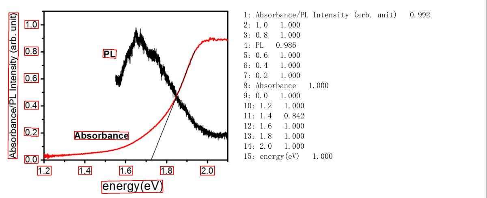
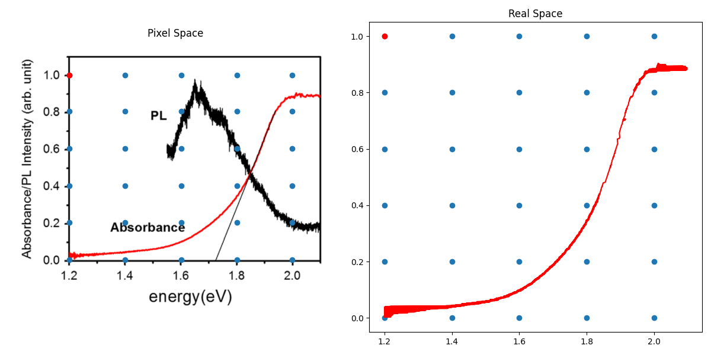

# Line plot digitizer

This notebook shows a method to extract data point position from certain color line plot. It only works for line plot will different colors and clear labels.

General procedures are:
1. extract pixel position of line with certain color in the graph
2. find pixel position of the axis labels.
3. use axis label content and their pixel position to establish corresponding relationship between pixel positon and real coordinate.
4. use the established corresponding relationshp to convert line plot in pixel space to real space. 

Some intermediate results are shown below.

find labels with paddle OCR

compare final result with original graph

