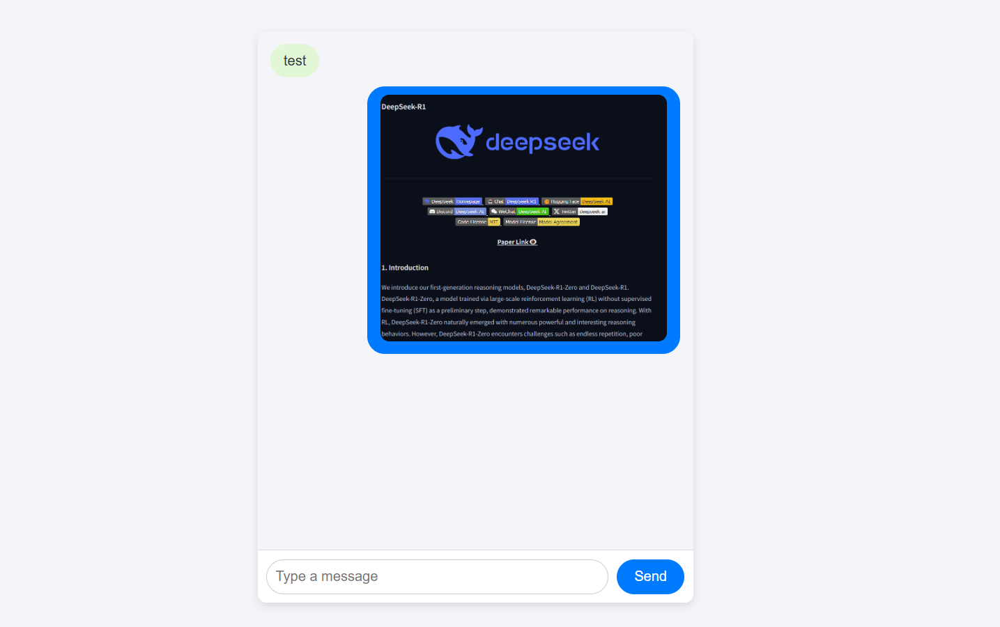

# what it is for

it is a local network picture and text sharing web server app. after clicking message.bat, it will run a simple python web server to serve public\index.html. you can access it in browser from local network using your other devices like cellphone. the website address is same as the one you used in your PC.

The front end file is public\index.html. back end file is app.py. all other files are python environment packed by conda-pack.


# how to use

<details>

<summary>warnings</summary>

------

This web app actaully creates a server that listens for all online requests, not just those from the local network. However, during testing in various scenarios, I found that it could only be accessed from the local network. I suspect this is due to router settings. For now, this behavior meets my needs, so I haven’t investigated further.

That said, I’ve provided a solution if you need to address this. Check the app.py file, lines 15 to 30, where you can configure the app to allow access only from authorized IPs. While a simple password protection mechanism should suffice, please use it at your own risk. Additionally, don’t forget to stop the server when it’s not in use(simply close the cmd window).

------
</details>

download [all-in-one.zip](https://github.com/HaoleiH/AI-driven-projects/releases/tag/v0.2). this zip file contains a portable python environment and the code needed to start the local website. This all-in-one.zip file only works on windows.

unzip. double-click Run_This.bat, give permission to python.exe in the pop-up window.

you will see it running on 3 addresses. 
use the last one, the one below "http://127.0.0.1:5000".
any device in local network should be able to visit that address. It is a static webpage so you will need to refresh it to see the update from other devices.

**Don't forget to close the server while not using.**

the default password is 2887,
you can change it in app.py

the public folder stores the webpage.
the uploads folder stores the images you pasted.
data.json store the chat history.

you can delete uploads and data.json to clear chat history.

**DO NOT delete folder public.**


# if you have python in your local environment

make sure you have flask installed, or

```bash
 pip install flask
```

download app.py and public, put them in the same directory, directly run 

```bash
 python app.py
```

This method should work on all platforms.
then the webserver is running.


# screenshot


